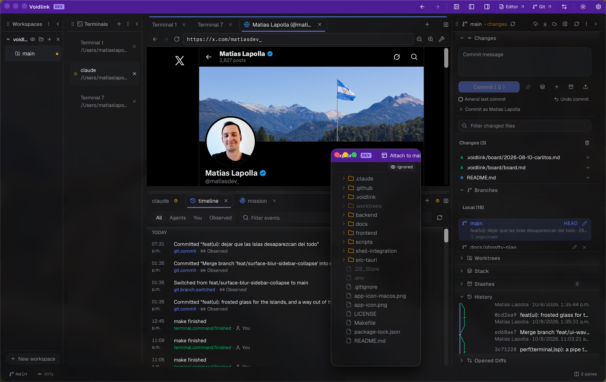

<div align="center">

# ◇ VoidLink

### The keyboard-driven Git workbench that runs entirely on your machine.

Editor, terminal, browser, and a Graphite-grade Git suite in one native window —
with optional AI that spawns **your own CLI**. No cloud. No telemetry. No
embedded model. The only outbound connections VoidLink ever makes are your git
remotes and, when you press Submit on a stack, `api.github.com`.

</div>

---



```
┌──────────────────────────────────────────────────────────────────────┐
│  ◇ voidlink            feature/auth ↑2   ✓ clean              ⌘K       │
├────────────┬─────────────────────────────────────────┬───────────────┤
│ ▾ src/     │  auth.rs                          ● dirty │ ▾ Stack       │
│   auth.rs  │  ─────────────────────────────────────── │  ● feature/ui │
│   lib.rs   │   1  use crate::session::Token;           │  │ feature/auth│
│ ▾ git/     │   2  pub fn verify(t: &Token) -> bool {   │  └ main       │
│   diff.rs  │   3 +    if t.is_expired() { return … }   │               │
│            │   4      t.signature_valid()              │ Restack ↻     │
│            │   5  }                                    │ Submit ↑      │
├────────────┴─────────────────────────────────────────┴───────────────┤
│  $ ▏                                                       bash · zsh -l │
└──────────────────────────────────────────────────────────────────────┘
```

---

## Why VoidLink

Most "AI dev tools" ship a model client, route your code through their backend,
and phone home. VoidLink takes the opposite stance:

- **Local-first.** Editor, terminal, browser and Git engine run in a single
  native binary. There is no backend service and no database.
- **Bring your own CLI.** AI features embed no model and call no provider API.
  They pipe context to the `claude` CLI you already have installed and read back
  stdout. Auth is whatever your `claude` is signed in as. If you want a key held
  for a CLI, VoidLink can keep it in your **OS keychain** (macOS Keychain,
  Windows Credential Manager, Linux secret-service) and export it into the child
  process only — never to `localStorage`, never to a config file, never off your
  machine. A stored secret is deliberately unreadable from the UI: there is no
  `secret_get` command.
- **Keyboard-first.** A command palette (`⌘K`), fuzzy file finder, worktree
  switcher, and ~45 global chords drive the whole app — all read from one
  declarative table, so a displayed accelerator can't drift from the chord that
  fires it.
- **A real Git engine.** Vendored `libgit2`, so the suite works without a system
  `git` binary for everything except the operations that must write git's own
  in-progress state files (merge, rebase, cherry-pick, revert, pull, worktrees).

---

## Features

### 🗂 Editor & files
- Monaco editor with multi-file tabs, dirty tracking, and **split editor groups**
- **Language servers** — `rust-analyzer` and `typescript-language-server` picked
  up from `PATH` if installed: completion, hover, signature help, go-to-definition,
  references, document symbols, formatting, diagnostics. Nothing is bundled;
  with neither installed, nothing breaks and no status chip appears.
- **Vim mode** (`monaco-vim`, lazily loaded, with a real mode indicator)
- **Breadcrumbs + Go to symbol** (`⌘⇧O`), with a regex outline fallback for
  languages Monaco has no symbol provider for
- **Inline `git blame`** (`⌘⌥B`) — end-of-line annotations plus a caret-line chip
  in the status bar, persisted and mirrored across windows
- **Three-way merge editor** — Ours │ Base │ Theirs above, editable Result below
- **Find and replace across files** (`⌘⌥F`), streaming, cancellable, with
  match-case / whole-word / include-gitignored toggles
- **Session restore** per file: cursor, scroll, selection, and fold state
- **External change detection** with an inline Keep mine / Take theirs / Show diff
- Format-on-save, trim trailing whitespace, insert final newline
- 15 editing commands (move/duplicate line, multi-cursor, sort, case transforms…)
- **Live Markdown preview** that mirrors the unsaved Monaco buffer, not the disk
- File tree with create / rename / delete, drag-out, gitignored-files eye toggle,
  and per-file Diff / Blame / Compare / Stage / Discard from the context menu
- **53 editor settings** with per-language overrides, rendered from one schema

### ▸ Terminal
- Real PTY sessions via `portable-pty`, rendered by `xterm.js` with **WebGL
  acceleration** (canvas fallback on context loss)
- Login shells with a cleared-and-rebuilt environment, so `PATH` resolves exactly
  as it does in Terminal.app — `claude`, `mise`, and Homebrew binaries just work
  in a Dock-launched app
- **Flow control**: a `yes`-style flood backpressures the shell instead of
  blowing xterm's buffer
- **Detach and reattach with scrollback replay** — move a pane, switch worktrees,
  and the terminal repaints correctly
- **Deep links in output** — click a `path:line`, a commit SHA, or a branch name
- **Unicode graphemes** so Ink TUIs (Claude Code, Codex, OpenCode) don't
  column-drift; Nerd-font aware; opt-in ligatures
- `OSC 9` / `OSC 777` desktop notifications from the shell; ambient bell handling
- Drop a file from the tree and its path is typed in, shell-quoted
- **Optional shell integration** (`shell-integration/voidlink.zsh|.bash`) emits
  `OSC 133`, which is the only way an activity dot can know a command *failed*
  rather than merely ended. Sourced by you, never injected into your rc files.

### ⎇ Git suite
Built on `libgit2`, with per-repo lock serialization and `.git/index.lock`
retry:

| Area | What you get |
|---|---|
| **Working tree** | Status, stage / unstage / stage-all, commit, amend, undo last commit |
| **Hunk & line level** | Stage or discard individual hunks, and **individual lines inside a hunk** (shift-click to extend a range) |
| **Review** | "Review all changes in one scroll" — staged, unstaged and untracked, sectioned and virtualized |
| **Image diffs** | Side-by-side · Swipe · Onion skin, with SVG as a picture-or-text toggle |
| **Commit identity** | Per-commit or per-repo author override, prefilled from git config, stored by VoidLink and never written to your git config |
| **Branches** | List, create, switch, rename, delete · MRU ordering · safe checkout with auto-stash · ahead/behind chips |
| **History** | Commit log, working-tree diff, ref-to-ref diff, and a **commit graph** (`⌘⇧H`) with lane routing and ref decoration chips |
| **Sync** | Fetch, pull, push (credential helper → SSH agent → `GITHUB_TOKEN`) |
| **Force push** | Only reachable from a non-fast-forward rejection, gated behind a 2-minute fetch-held lease, and the confirm names the exact oid being overwritten |
| **Rewrite** | Merge, rebase, cherry-pick, revert — each with continue / abort and an operation banner |
| **Reset** | Soft / mixed / hard reset to any ref |
| **Stash** | Save (keep-index / include-untracked), list, apply, pop, drop — addressed by oid |
| **Tags** | Create (lightweight or annotated), delete locally and on the remote, push |
| **Worktrees** | Create, list, unlock, remove; open any as a workspace; live dirty / ahead-behind / locked badges |
| **Remotes** | Add, remove, rename, set URL |
| **Git config** | Edit a curated allowlist of keys at local or global scope, with per-row provenance (`from global`, `local · overrides global`, …) |

The suite also opens as a **separate OS window** (`⌘⇧G`), as does the editor,
and any sidebar can be **detached into its own window**. See
[docs/features/git-window.md](docs/features/git-window.md).

### ⫶ Stacked PRs
Graphite-style stacked branches:
- Parent pointers live in `.git/config`; the stack is discovered by walking to a
  trunk you can override per repo
- **Restack is entirely in-memory libgit2** — no `git` binary, no working-tree
  mutation, and on conflict nothing is mutated at all
- **Submit** the stack as a chain of draft GitHub PRs, each body carrying a
  managed footer showing its place in the stack
- BYO-token: `GITHUB_TOKEN` from your environment, nothing written to disk

### ⚔ Conflicts & compare
- In-progress merge / rebase / cherry-pick / revert detected from git's own state
  files, with a Continue / Abort banner
- One merge-editor tab per conflicted path, plus a per-conflict card list with
  its own Accept ours / theirs / both
- **Branch compare** (`⌘⇧C`): any two revparse-able refs, two-dot or merge-base,
  with a changed-file tree, swap, and ignore-whitespace — all per tab

### 🌐 Embedded browser
Browser tabs backed by **real child webviews**, not iframes — own process, own
cookie jar, no `X-Frame-Options` fight. Address bar, back / forward / reload,
per-tab persisted zoom, devtools toggle. A navigation policy allows `http(s)`
and renderable `file://` documents and refuses everything else. No script of
VoidLink's ever enters a page.

### 🤖 AI — your own Claude Code CLI
No embedded model, no provider API calls, no telemetry. VoidLink spawns the
`claude` CLI you already have and pipes context to it:
- **Commit drafting** (`⌘⇧M`) — the staged diff goes to your CLI; the message
  comes back on stdout and is appended, never overwriting what you typed
- **Repo agent** (`⌘⇧A` slide-over, `⌘⌥A` tab) — prompts grounded in *live
  workspace state* (branch, status, recent log, staged diff, open files) with a
  **"Context used (N)"** disclosure listing exactly what fed the answer
- **Agent roster** — named `claude` configurations built in **Settings → AI**
  (model, system prompt, permission mode, effort, tool lists, add-dirs), each
  with a colour, a composed-command preview, and a **Test** button
- **Annotated diffs** — comment on a hunk, and the next agent turn in that repo
  reads your notes as context
- **Fan-out runs** — one prompt, N agents, N worktrees, N branches, supervised
  from Rust so a run outlives the window that started it; results come back as a
  file × leg divergence matrix you can adopt or discard. It deliberately does not
  pick a winner.
- **Triggers** — "when X happens, run agent Y", with a kill switch, a dry run
  against the last 7 days, and re-entrancy guards. New rules land disabled.
- **Provenance notes** — diffs carry hedged, evidence-named notes about likely
  AI authorship at file and commit level. There is deliberately no hunk-level claim.

**Claude Code only, and no key required.** Other CLIs still work through the
settings JSON (`ai.commitCommand`, `ai.agentCommand`) but are not offered in the
dialog.

### 🎛 Mission Control & the event log
Rust keeps an **append-only journal** (`events.jsonl` in your OS app-data dir,
six-week retention) of agent turns, terminal commands, commits, branch switches
and operations. Git events come from a filesystem watcher, so work you do in an
external shell lands too.

- **Timeline** — the log for one repo, day-grouped, filterable by who
- **Mission Control** — the first surface not scoped to one worktree:
  **Lineup** (every checkout, busiest first) · **Check-in** (what happened while
  you were asleep — it reports verbatim, it never summarises) · **Runs** ·
  **Triggers** · **Hill charts** (the one number in the app moved only by hand)
- **Notifications** — dispatched by Rust as a *policy over the log*, not by call
  sites: longest-prefix rules × {Off, Sound, Banner, Both}, suppression of what
  you're already watching, coalescing, and quiet hours. Five embedded sound cues,
  original to this repo.

### 📋 Board & brain — plain markdown in your repo
- **Project board** — a kanban whose cards are markdown files under
  `<repo>/.voidlink/board/`. Dragging a card is a file write; an agent can move
  one by writing a file. Nothing is ever staged or committed.
- **Project brain** — per-repo notes under `<repo>/.voidlink/brain/` in six
  types (decision, shipped, note, discovery, content, training), with type
  filters, fuzzy title search and quick capture.

### 🪟 Workspaces, tabs & layout
- **Workspace → worktree → pane group → tab group → tab.** The worktree is the
  scoping unit for essentially all tab state.
- **Recursive split panes** — drag a tab into the outer edge of a group to split;
  panes live in one flat layer, so moving a tab never reparents a terminal or a
  webview
- **14 tab kinds**: file, terminal, diff, compare, stack, conflict, history,
  preview, timeline, combined diff, mission, browser, agent, pane group
- **Tab groups** — named, coloured, collapsible, with manual / by-kind / by-worktree
  auto-grouping; horizontal **or vertical** tab strips; pin, rename (`F2`), colour
- **Stacked or detached** environment modes: editor and git as views in the
  workbench, or as real OS windows on other displays
- **Layout presets** (an arrangement) and **snapshots** (a whole session), both
  recalled by name
- **Zen mode** (`⌘⌥Z`) and pane maximize (`⌘⌥M`) as render filters that never
  touch the pane tree
- A **priority-registry status bar** whose chips name their own chord and collapse
  lowest-priority-first
- **10 themes** applied instantly across UI, editor and terminal, plus background
  images with adjustable opacity and blur

### ⌘ Command-driven workflow
- **Command palette** (`⌘K`), **fuzzy file finder** (`⌘P`), **worktree switcher**
  (`⌘⇧P`), **tab switcher** (`⌘⇧E`), held-modifier **MRU cycling** (`⌃Tab`)
- **Shortcut cheat sheet** (`⌘⇧/`) read from the same table that fires the chords
- **Secret scanner** — every commit's added lines are scanned against nine rules
  (AWS, GitHub, Anthropic, OpenAI, Google, Slack, private keys, generic
  assignments) with masked previews. It defers, it does not block — and because
  it isn't a git hook, committing from a terminal bypasses it.

---

## Documentation

- **[Feature reference](./docs/features/README.md)** — 28 pages, one per feature:
  what it does, how to use it, its shortcuts, and **its real limits**. Start with
  [keyboard shortcuts](./docs/features/keyboard-shortcuts.md).
- **[Decisions](./docs/decisions/)** — costed architectural calls, including why
  the terminal is *staying* on xterm.js rather than moving to Ghostty's VT engine.
- **[Audits](./docs/audits/)** — read-only reviews of a surface, finding by
  finding, each with a severity, a confidence level and the evidence behind it.
- **[TODO](./docs/TODO.md)** — everything open, ranked, including what is blocked
  on the pinned webview engine and cannot be built today.
- **[Manual de uso](./docs/manual-de-uso.md)** — guided walkthrough (Spanish,
  partially stale; `docs/features/` is the verified reference).

---

## Tech stack

| Layer | Technology | Role |
|---|---|---|
| Desktop shell | **Tauri 2** (`=2.11.2`, `unstable`) | Native windows, JS ↔ Rust IPC, child webviews |
| Core logic | **Rust** (~26k lines, 157 IPC commands) | Git, PTY, browser, LSP, journal — all heavy work |
| Frontend | **SolidJS 1.9 + TypeScript 5.9 + Vite 7** | Fine-grained reactive UI |
| Styling | **Tailwind CSS 4** + `lucide-solid` + Geist | Utilities, icons, type |
| Editor | **Monaco** + `monaco-vim` | Code editing, vim mode |
| Language servers | hand-rolled JSON-RPC client + Rust supervisor | rust-analyzer, typescript-language-server |
| Terminal | **portable-pty** + **xterm.js 6** (WebGL) | Real PTYs, GPU-accelerated rendering |
| Git | **git2 0.19** (vendored `libgit2`) | Git ops without a system `git` binary |
| Browser | Tauri child webviews, driven from Rust | Real browser tabs, own cookie jar |
| Secrets | **keyring 4.1** | OS credential store; values never cross IPC |
| Watching | **notify-debouncer-full** | Repo and board change pulses |
| Notifications | **tauri-plugin-notification** + **rodio** | OS banners and embedded sound cues |
| HTTP | **reqwest** (blocking, rustls) | GitHub REST for stacked-PR submit |
| Markdown | **marked** + **DOMPurify** | Sanitized preview, shared with the brain |
| AI | **Claude Code CLI bridge** | Spawns your own authenticated `claude` |

No embedded LLM client. No database. No backend service. No analytics.

---

## Quick start

**Prerequisites**
- **Node.js** 22 (20.19+ works; CI uses 22)
- **Rust** 1.88+ — the floor is set by `keyring` 4.x, not by the app
- **Tauri CLI**: `cargo install tauri-cli`
- **macOS:** Xcode Command Line Tools (`xcode-select --install`)
- **Linux:** `sudo apt install libwebkit2gtk-4.1-dev libappindicator3-dev librsvg2-dev patchelf`

```bash
cd frontend && npm install && cd ..

make dev        # the desktop app, with purple dev chrome so a dev window
                # is never mistaken for the installed bundle
make frontend   # Vite only, no native shell — http://localhost:5173
```

`make` with no target lists everything.

---

## Configuration

VoidLink needs **zero environment variables to run**.

| Variable | Used by | Description |
|---|---|---|
| `GITHUB_TOKEN` | push / pull / stack submit | PAT with `repo` scope, used after the credential helper and SSH agent. Never stored on disk. |

Provider keys for AI CLIs (`ANTHROPIC_API_KEY`, `CLAUDE_CODE_OAUTH_TOKEN`,
`OPENAI_API_KEY`, `GEMINI_API_KEY`, `OPENROUTER_API_KEY`, or your own bindings)
can optionally be stored in the **OS keychain** and injected into the spawned
CLI's environment only. A blocklist prevents a "key" from binding to `PATH`,
`LD_PRELOAD`, `NODE_OPTIONS` and friends. Everything else — themes, editor,
terminal, AI commands, agent roster, notification rules — lives in the settings
dialog (`⌘,`), which also has a JSON view backed by a generated schema.

---

## Building

```bash
make bundle                                  # native installer
make bundle B=dmg TARGET=universal-apple-darwin
make version V=0.2.0                         # bumps all three manifests together
```

## Tests

```bash
make test                    # vitest (unit + render) and cargo test
make check                   # everything CI runs, plus cargo check
cd frontend && npm run test:browser   # real Chromium, for geometry-dependent UI
```

**401 Rust tests** across 42 files, and three vitest projects: `unit` (node),
`render` (jsdom), and `browser` (headless Chromium via Playwright, with committed
screenshot baselines). The browser project is excluded from `make test` because
its binaries are a ~300 MB download.

---

## Project structure

```
voidlink/
├── frontend/                 # SolidJS + Vite + TypeScript
│   └── src/
│       ├── main.tsx          # Dispatches on window label → four Solid roots
│       ├── App.tsx           # Workbench   ├── EditorApp.tsx  # Editor window
│       ├── GitApp.tsx        # Git window  └── PanelApp.tsx   # Detached sidebar
│       ├── api/              # IPC wrappers, one module per Rust module
│       ├── commands/         # Palette, keymap, file finder, toasts, prompts,
│       │                     #   secret scan, snapshots, AI commit, agent
│       ├── components/
│       │   ├── editor/       # Monaco, LSP client, blame, merge editor, diff
│       │   ├── terminal/     # xterm pane, links, flow control
│       │   ├── browser/      # Child-webview browser tabs
│       │   ├── git/          # Sidebar, diff engine, compare, conflict,
│       │   │                 #   history, stack, worktree wizard
│       │   ├── agent/        # Thread, slide-over, dashboard
│       │   ├── mission/      # Lineup, check-in, runs, triggers, hills
│       │   ├── timeline/ board/ brain/ search/ files/ preview/
│       │   ├── settings/     # Eleven panes + JSON editor
│       │   ├── layout/       # Shell, tabs, panes, sidebars, status bar
│       │   └── ui/           # Button, Dialog, Menu, Tooltip, Disclosure
│       └── store/            # layout/ (split tree, tabs, docking, presets),
│                             #   settings, themes, activity, fanout, triggers
└── src-tauri/                # Rust
    └── src/
        ├── lib.rs            # 157 commands, global state, PTY engine
        ├── git/              # libgit2 engine (47 files) + stack/
        ├── agent/ fanout/    # Streaming CLI turns, multi-worktree supervisor
        ├── browser/          # Child-webview tabs
        ├── lsp/              # Language-server supervision + JSON-RPC framing
        ├── journal/ notify/  # Event log, and notification policy over it
        ├── watch/            # Filesystem watcher → git/board pulses
        ├── secrets/          # OS keychain (no read path back to the webview)
        ├── board/ brain/     # Markdown under <repo>/.voidlink/
        ├── fs/               # File tree + streaming find-in-files
        └── window.rs menu.rs # Satellite windows, macOS menu
```

---

## License

[MIT](./LICENSE)
